## 部署 Byzer
通过在 Xuanwu 中添加 Byzer 应用，用户可以通过 Xuanwu 轻松启动一个 Data+AI 平台，并且可以使用 Byzer Notebook 来进行人机交互，进行数据加载，加工，探索，可视化，机器学习等诸多工作。 

### 创建资源池和租户
以 Xuanwu 平台管理员身份登录，先创建资源池：

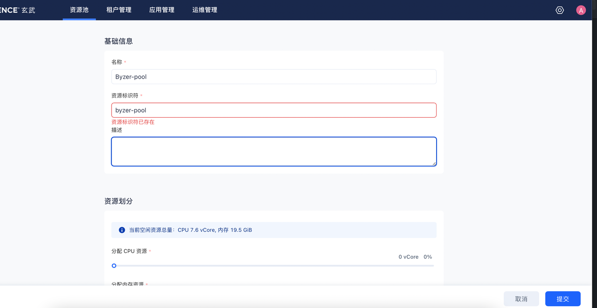

创建后的结果如下：

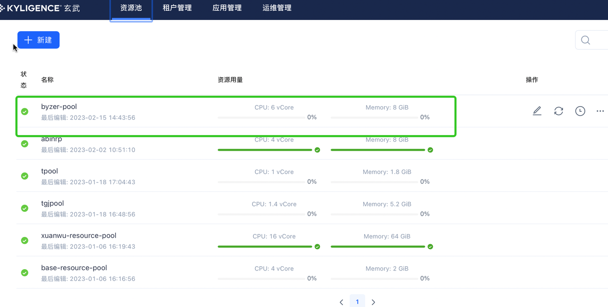

接着进入 租户管理 标签，点击新建租户，创建名称为 byzer 的租户。其中资源池需要选择刚刚创建的那个资源池。 

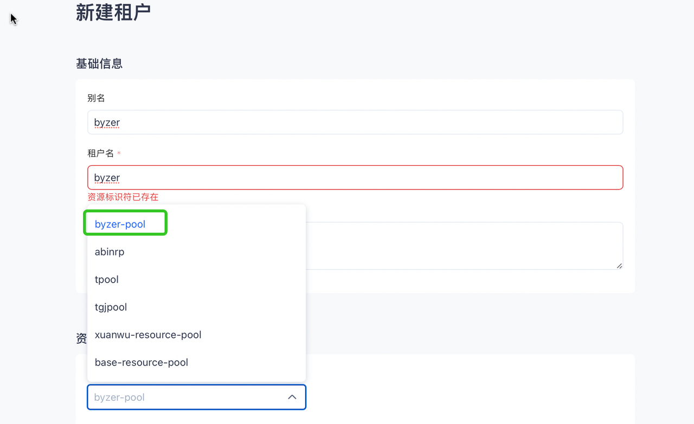

### 添加应用

 Byzer 目前包含两部分，Byzer-lang 和 Byzer Notebook。我们先添加 Byzer-lang。 进入 应用管理 标签，然后点击 "新建" 按钮，进入创建平台应用界面。

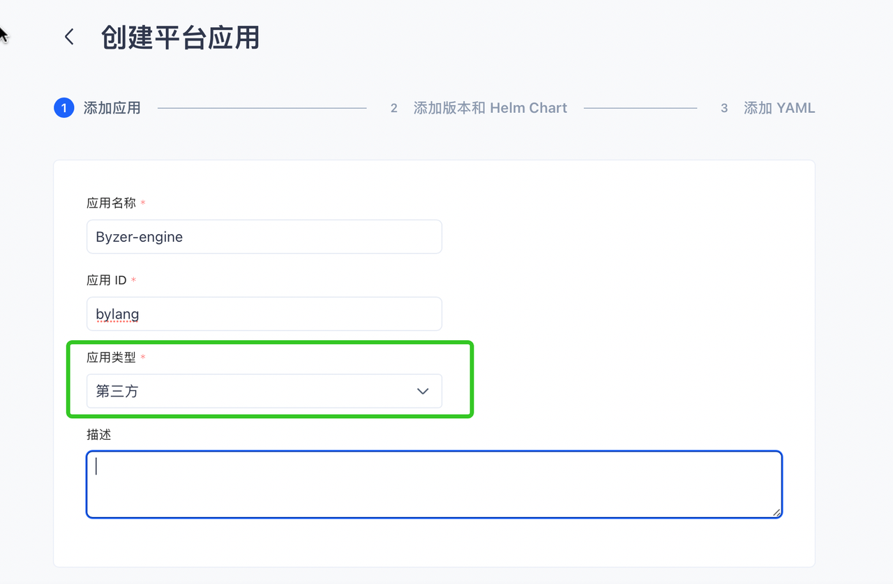

应用类型选择第三方即可，点击下一步。

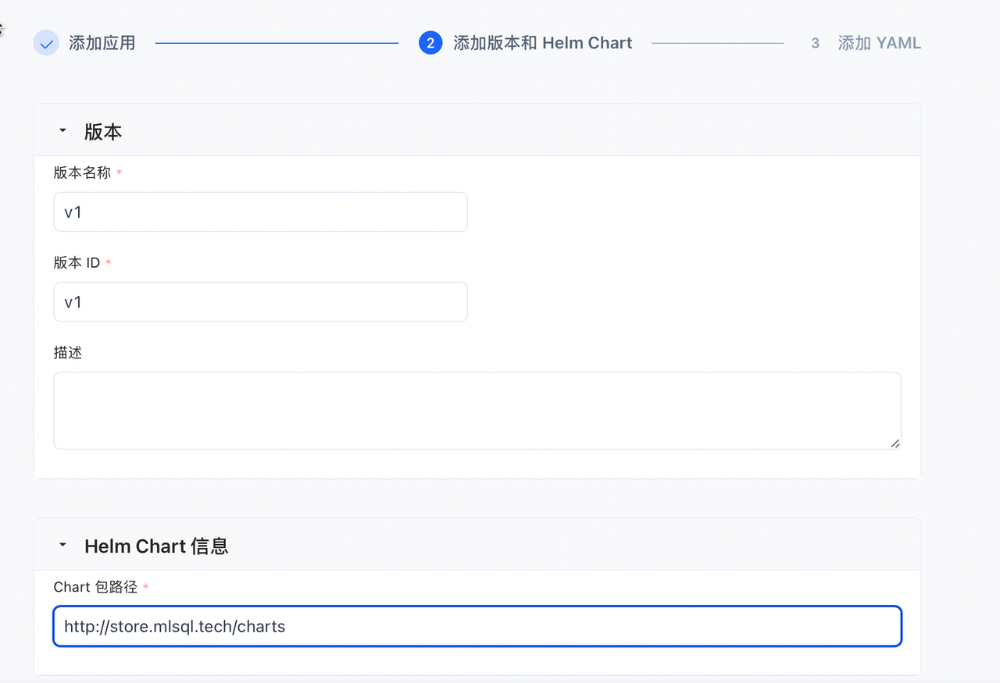


这里主要是需要填写 Byzer Helm Chart 信息，地址为：
```
http://store.mlsql.tech/charts/byzer-lang-0.1.9.tgz
```
点击下一步会出现如下界面：

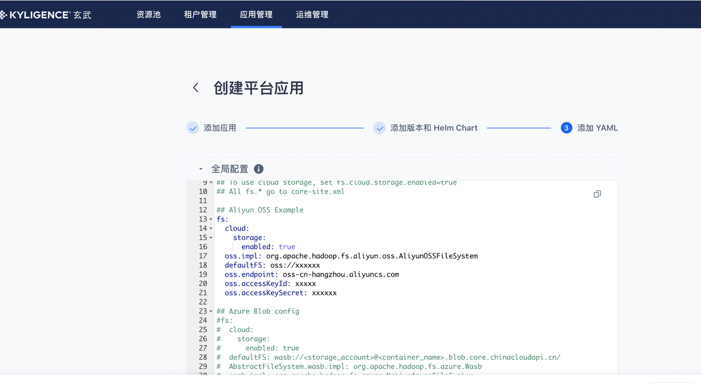

全局配置我们忽略，我们只修改租户配置，将如下配置黏贴到 租户配置 编辑框中：
```
## 对象存储配置
fs:
  cloud:
    storage:
      enabled: true
  oss.impl: org.apache.hadoop.fs.aliyun.oss.AliyunOSSFileSystem
  defaultFS: oss://xxxxxx
  oss.endpoint: oss-cn-hangzhou.aliyuncs.com
  oss.accessKeyId: xxxxx
  oss.accessKeySecret: xxxxxx


streaming:
  datalake.path: /byzer/_delta
  plugin.clzznames: tech.mlsql.plugins.ds.MLSQLExcelApp,tech.mlsql.plugins.assert.app.MLSQLAssert,tech.mlsql.plugins.shell.app.MLSQLShell,tech.mlsql.plugins.mllib.app.MLSQLMllib
  name: byzer-lang

## 资源配置
spark:
  driver.memory: 4g
  driver.cores: 2
  driver.maxResultSize: 1g  
  executor.memory: 1g
  executor.cores: 1
  executor.instances: 1  


## 镜像配置
image:
  repository: registry.cn-shanghai.aliyuncs.com/kyligence-byzer/byzer-lang-k8s-full
  pullPolicy: Always
  # Overrides the image tag whose default is the chart appVersion.
  tag: "3.3.0-2.4.0-SNAPSHOT-2023-02-16"
  imagePullSecrets: []
```
点击发布，此时就可以看到如下界面：

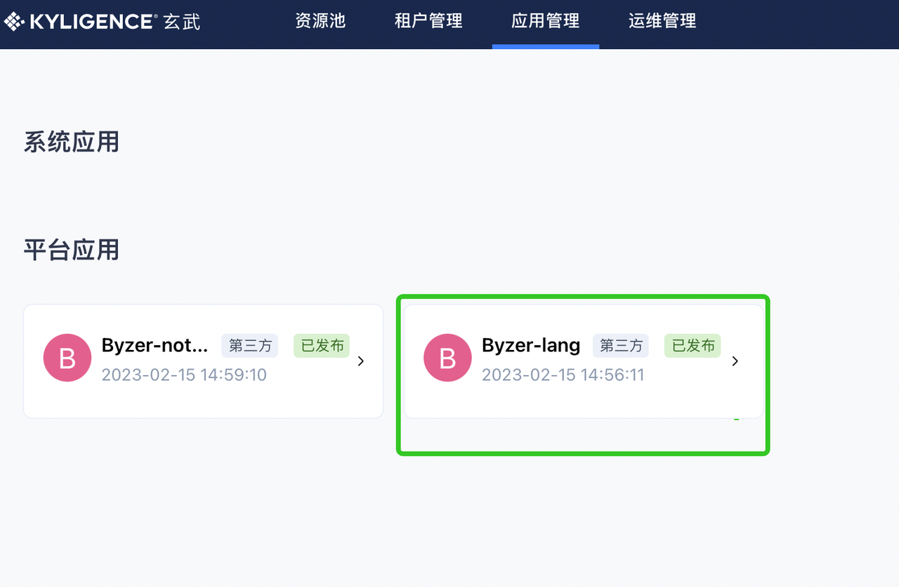


Byzer Notebook 也是用相同的方式发布。
其中，Helm 地址为：
```
http://store.mlsql.tech/charts/byzer-notebook-0.1.9.tgz
```

租户配置为：
```
## notebook 的服务名
name: byzer-nb-v3-byzer-notebook
## Byzer引擎的服务名
engine: byzer-lang-v2-service

domain: cluster.local

## 数据库配置
notebook:
  port: 9002
  database.port: 3306
  database.name: notebook  
  database.ip: "mariadb.default.svc.cluster.local"
  database.username: "byzer"
  database.password: "byzer"

## 镜像配置
image:
  repository: registry.cn-shanghai.aliyuncs.com/kyligence-byzer/byzer-notebook
  pullPolicy: IfNotPresent
  # Overrides the image tag whose default is the chart appVersion.
  tag: "latest"


serviceAccount:
  # Annotations to add to the service account
  annotations: {}
  # The name of the service account to use.
  # If not set and create is true, a name is generated using the fullname template
  name: "byzer"
```

运行应用

以租户身份登录：

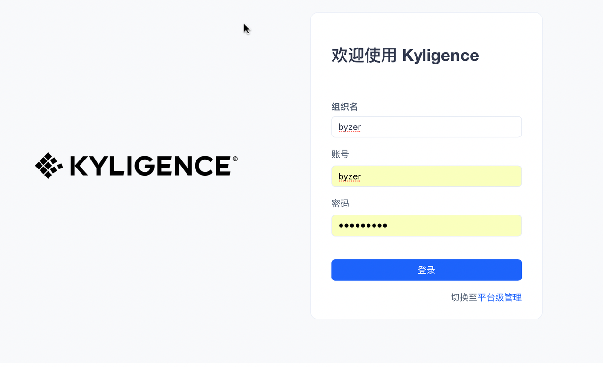


进入用户管理界面，此时可以看到 平台应用 列表：
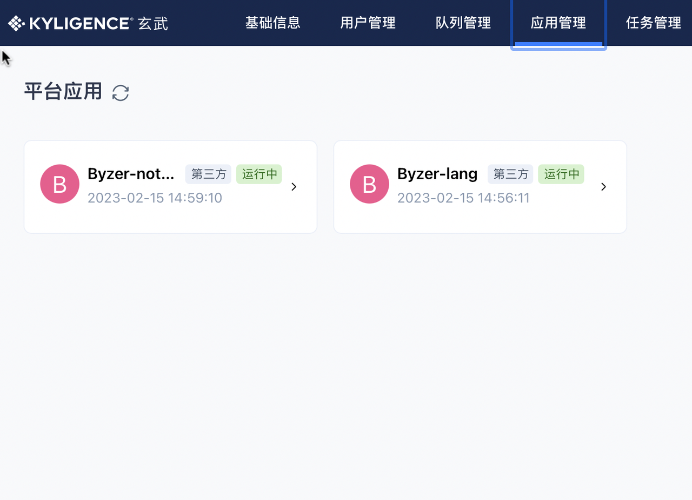

我们需要按顺序启动，先启动 Byzer-lang, 再 启动 Byzer-notebook。点击 Byzer-lang 应用，会有个侧边栏，点击侧边栏的三个小点点：

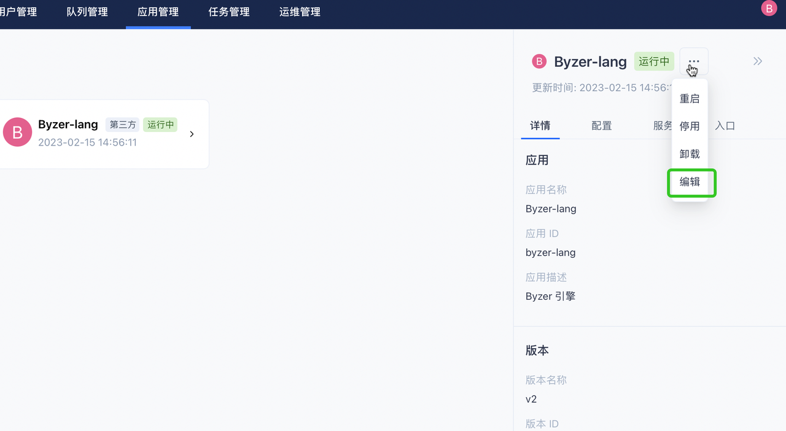

然后选择编辑，此时就可以修改“租户自定义配置”了。我们根据模板填充或者修改：
1. 对象存储地址信息
2. 镜像信息
此外，用户可能还需要对接监控和对象存储，添加如下模板：
```
spark:
  driver.memory: 2g
  driver.cores: 2
  driver.maxResultSize: 1g  
  executor.memory: 2g
  executor.cores: 2
  executor.instances: 2 
  ui.prometheus.enabled: true
  
  metrics.appStatusSource.enabled: true
  kubernetes.driver.annotation.executors.prometheus.io/scrape: true
  kubernetes.driver.annotation.executors.prometheus.io/path: /metrics/executors/prometheus
  kubernetes.driver.annotation.executors.prometheus.io/port: 4040
  kubernetes.driver.annotation.jmx.prometheus.io/scrape: true
  kubernetes.driver.annotation.jmx.prometheus.io/path: /metrics
  kubernetes.driver.annotation.jmx.prometheus.io/port: 8080
  kubernetes.executor.annotation.jmx.prometheus.io/scrape: true
  kubernetes.executor.annotation.jmx.prometheus.io/path: /metrics
  kubernetes.executor.annotation.jmx.prometheus.io/port: 8080
  metrics.conf.*.sink.jmx.class: org.apache.spark.metrics.sink.JmxSink
  
  ui.proxyBase: /sparkui/byzer-lang-v2-service
  ui.proxyRedirectUri: /
  kubernetes.driver.annotation.spark.kyligence.io/proxy.url: /sparkui/byzer-lang-v2-service
  kubernetes.driver.annotation.spark.kyligence.io/deploy.model: client
  kubernetes.executor.annotation.spark.kyligence.io/proxy.url: /sparkui/byzer-lang-v2-service
  kubernetes.executor.annotation.spark.kyligence.io/deploy.model: client
 
  shuffle.manager: org.apache.spark.shuffle.rss.RssShuffleManager
  
  rss.master.address: 10.1.2.146:9097
  serializer: org.apache.spark.serializer.KryoSerializer
  rss.shuffle.writer.mode: hash
  rss.push.data.replicate: true
  shuffle.service.enabled: false
  sql.adaptive.localShuffleReader.enabled: false
  sql.adaptive.enabled: true
  sql.adaptive.skewJoin.enabled: true
```

一般而言，用户仅需修改 ```spark.rss.master.address``` 地址和 ```byzer-lang-v2-service``` 这个字符串。这个是 byzer-lang 的在 Kubenertes 里的服务名。

现在可以点击启动。启动完成后，可以点击任务管理，就能看到运行的 Byzer 引擎：
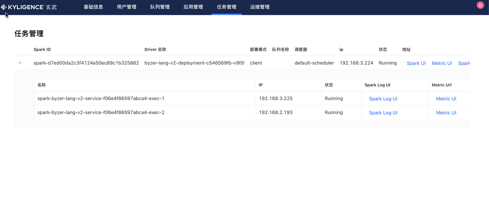

在这里，你可以查看 SparkUI，获取指标监控以及日志等。

我们可以用相同的方式启动 Byzer notebook。这里是 Byzer Notebook 租户自定义配置编辑后的配置：
```
# Default values for byzer-notebook.
# This is a YAML-formatted file.
# Declare variables to be passed into your templates.
name: byzer-nb-v3-byzer-notebook
engine: byzer-lang-v2-service
domain: cluster.local

notebook:
  port: 9002
  database.port: 3306
  database.name: notebook  
  database.ip: "mariadb.default.svc.cluster.local"
  database.username: "byzer"
  database.password: "byzer"


image:
  repository: registry.cn-shanghai.aliyuncs.com/kyligence-byzer/byzer-notebook
  pullPolicy: IfNotPresent
  # Overrides the image tag whose default is the chart appVersion.
  tag: "latest"


serviceAccount:
  # Annotations to add to the service account
  annotations: {}
  # The name of the service account to use.
  # If not set and create is true, a name is generated using the fullname template
  name: "byzer"
```
只需要修改 name, engine, 以及数据库配置即可。
