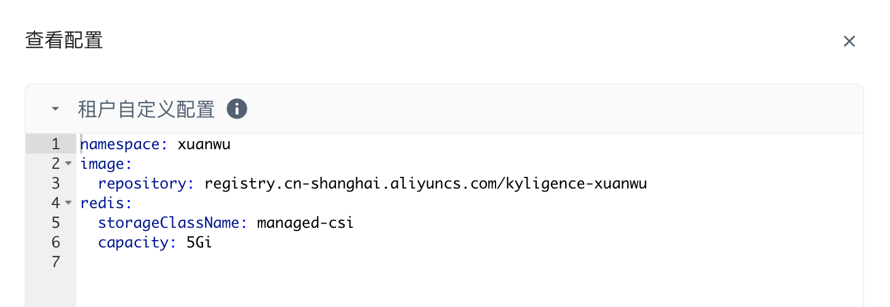

## 部署离线计算服务
### 1. 管理员创建租户
仅平台管理员有权限创建租户，需要以平台管理员身份登录 Xuanwu Manager 
#### 1.1 创建资源池
租户运行各类数据应用需要的计算资源将通过资源池创建

####  1.2 创建租户
创建租户时与资源池绑定，即可使租户应用获得可用计算资源

###  2. 租户部署离线计算服务
在 Xuanwu Manager 应用中心找到对应的服务，根据提示完成部署

#### 2.1 部署 ZK
修改配置文件

#### 2.2 部署 MariaDB
修改配置文件

#### 2.3 部署 Redis
修改配置文件

#### 2.4 部署 元数据服务
修改配置文件

#### 2.5 部署 JDBC 服务
修改配置文件

#### 2.6 部署 RSS 服务
修改配置文件
